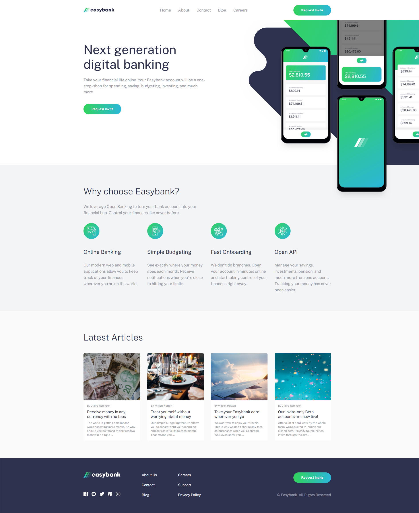
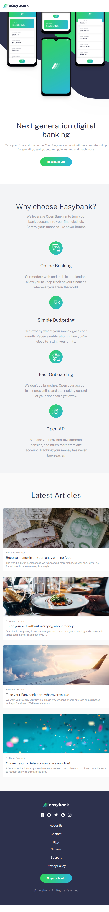
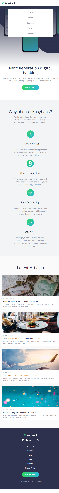

# Easybank landing page

This is a solution to the Easybank landing page.

Users should be able to:

- View the optimal layout for the site depending on their device's screen size
- See hover states for all interactive elements on the page

## Table of contents

- [Overview](#overview)
  - [Link](#link)
  - [Screenshots](#screenshots)
- [My process](#my-process)
  - [Built with](#built-with)
- [Author](#author)

## Overview

### Link

- URL: [Easybank landing page](https://your-solution-url.com)

### Screenshots

## My process

### Built with

- Semantic HTML5 markup
- CSS custom properties
- Flexbox
- CSS Grid
- Mobile-first workflow
- JavaScript

## Author

- Website - [Xiaomin Guo](https://easybank-landing-page-aislandmin.vercel.app/)
